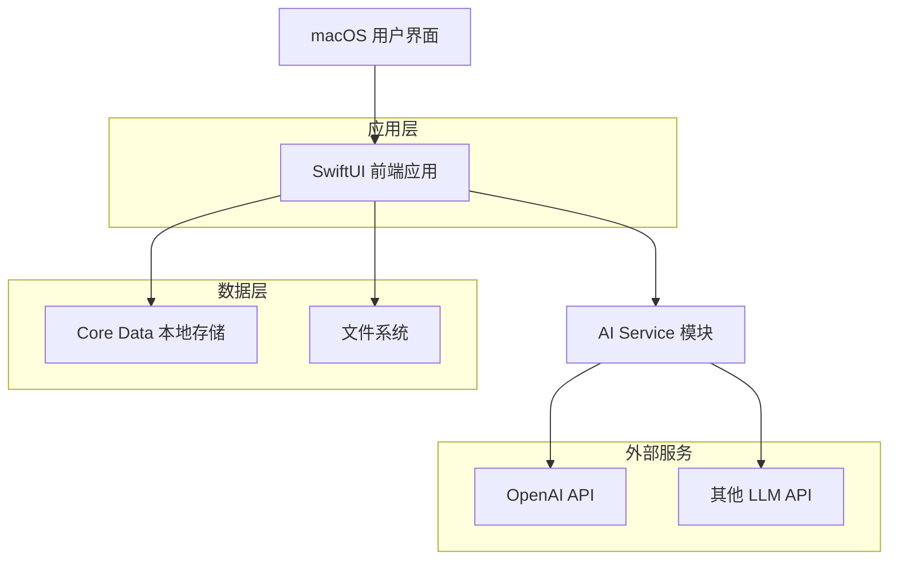
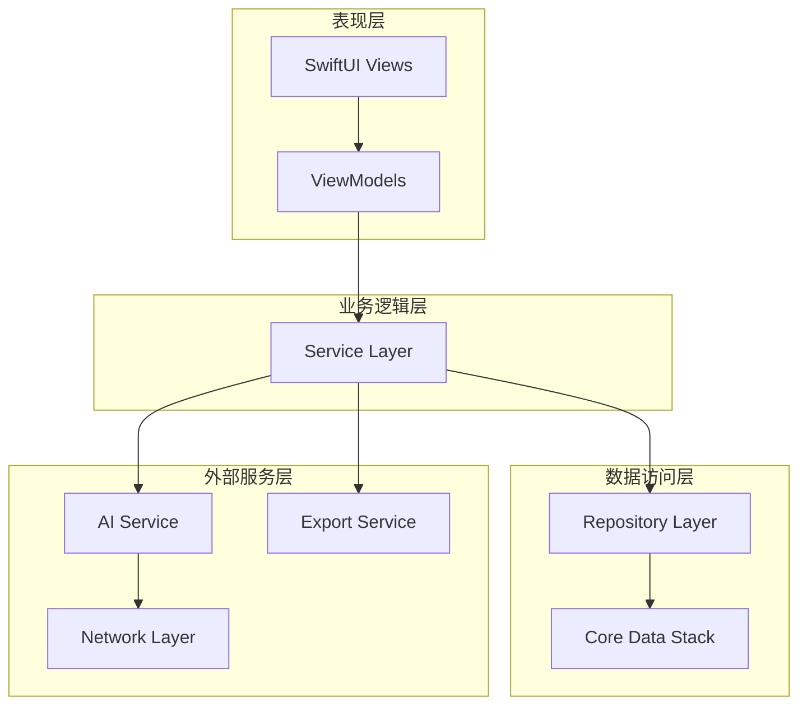
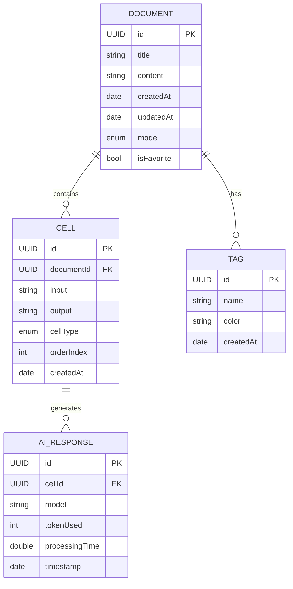

# Scribe - macOS 智能笔记应用技术架构文档

## 1. 架构设计



## 2. 技术描述

- **前端框架**：SwiftUI + Combine + macOS SDK
- **数据存储**：Core Data (本地数据库) + FileManager (文件系统)
- **AI 集成**：URLSession + Codable (HTTP 客户端)
- **开发工具**：Xcode 15+, Swift 5.9+

## 3. 路由定义

| 路由 | 用途 |
|------|------|
| MainView | 主界面，包含侧边栏和编辑区域 |
| DocumentListView | 文档列表视图，显示所有笔记 |
| NoteEditorView | 普通笔记编辑器视图 |
| JupyterModeView | Jupyter 模式编辑器视图 |
| SettingsView | 设置页面，配置 AI 和导出选项 |
| ExportView | 导出功能视图 |

## 4. API 定义

### 4.1 核心 API

**AI 文本处理接口**
```swift
func processWithAI(input: String, model: AIModel) async throws -> AIResponse
```

请求参数:
| 参数名称 | 参数类型 | 是否必需 | 描述 |
|----------|----------|----------|------|
| input | String | true | 用户输入的文本内容 |
| model | AIModel | true | 选择的 AI 模型类型 |
| temperature | Double | false | 生成文本的随机性，默认 0.7 |
| maxTokens | Int | false | 最大生成 token 数，默认 1000 |

响应参数:
| 参数名称 | 参数类型 | 描述 |
|----------|----------|------|
| content | String | AI 生成的响应内容 |
| usage | TokenUsage | Token 使用统计 |
| model | String | 实际使用的模型名称 |

示例:
```json
{
  "input": "请帮我总结这段文字的要点",
  "model": "gpt-4",
  "temperature": 0.7,
  "maxTokens": 500
}
```

**文档导出接口**
```swift
func exportDocument(document: Document, format: ExportFormat) async throws -> URL
```

请求参数:
| 参数名称 | 参数类型 | 是否必需 | 描述 |
|----------|----------|----------|------|
| document | Document | true | 要导出的文档对象 |
| format | ExportFormat | true | 导出格式 (PDF, HTML, Markdown) |
| includeMetadata | Bool | false | 是否包含元数据，默认 true |

响应参数:
| 参数名称 | 参数类型 | 描述 |
|----------|----------|------|
| fileURL | URL | 导出文件的本地路径 |
| fileSize | Int64 | 文件大小（字节） |
| exportDate | Date | 导出时间 |

## 5. 服务架构图



## 6. 数据模型

### 6.1 数据模型定义



### 6.2 数据定义语言

**Document 表 (文档)**
```swift
// Core Data Entity
@NSManaged public class Document: NSManagedObject {
    @NSManaged public var id: UUID
    @NSManaged public var title: String
    @NSManaged public var content: String
    @NSManaged public var createdAt: Date
    @NSManaged public var updatedAt: Date
    @NSManaged public var mode: String // "normal" or "jupyter"
    @NSManaged public var isFavorite: Bool
    @NSManaged public var cells: NSSet?
    @NSManaged public var tags: NSSet?
}

// 扩展方法
extension Document {
    var cellsArray: [Cell] {
        let set = cells as? Set<Cell> ?? []
        return set.sorted { $0.orderIndex < $1.orderIndex }
    }
}
```

**Cell 表 (单元格)**
```swift
@NSManaged public class Cell: NSManagedObject {
    @NSManaged public var id: UUID
    @NSManaged public var documentId: UUID
    @NSManaged public var input: String
    @NSManaged public var output: String?
    @NSManaged public var cellType: String // "text", "code", "markdown"
    @NSManaged public var orderIndex: Int32
    @NSManaged public var createdAt: Date
    @NSManaged public var document: Document?
    @NSManaged public var aiResponses: NSSet?
}
```

**AI Response 表 (AI 响应记录)**
```swift
@NSManaged public class AIResponse: NSManagedObject {
    @NSManaged public var id: UUID
    @NSManaged public var cellId: UUID
    @NSManaged public var model: String
    @NSManaged public var tokenUsed: Int32
    @NSManaged public var processingTime: Double
    @NSManaged public var timestamp: Date
    @NSManaged public var cell: Cell?
}
```

**初始化数据**
```swift
// 创建示例文档
let sampleDocument = Document(context: context)
sampleDocument.id = UUID()
sampleDocument.title = "欢迎使用 Scribe"
sampleDocument.content = "这是您的第一个笔记文档。您可以在普通模式下编写文字，或切换到 Jupyter 模式体验 AI 助手功能。"
sampleDocument.mode = "normal"
sampleDocument.createdAt = Date()
sampleDocument.updatedAt = Date()
sampleDocument.isFavorite = false

// 保存上下文
try context.save()
```